# workflow tutorial

``` r

library(seatrackRgls)
knitr::opts_chunk$set(
  collapse = TRUE,
  comment = "#>"
)
```

Prepare basic metadata for calibration. Basic metadata must have
`logger_id`, `logger_model`, `species`, `colony`, `date_deployed`,
`date_retrieved` columns. It is expected to be one row per
logger/retrieval year combination.

``` r

print(example_metadata)
#>   logger_id logger_model date_deployed date_retrieved  colony
#> 1      C411       mk4083    2015-06-11     2017-06-11 Sklinna
#>                  species
#> 1 Black-legged kittiwake
```

Prepare colony information. Colony information must have `colony`,
`col_lat`, `col_lon` columns.

``` r

print(example_colony_info)
#>    colony col_lat col_lon
#> 1 Sklinna  65.202  10.995
```

Set your import directory, where your light data is placed. Light data
is expected to be in the format
`<logger_id>_<year_retrieved>_<logger_model>`, e.g. `C411_2017_mk4083`

``` r

import_dir <- "light_data"
```

``` r

print(list.files(import_dir))
#> [1] "C411_2017_mk4083.lig"
```

Also set up an export directory, where all outputs will be saved.

``` r

export_dir <- "processed_light_data"
```

With all this loaded, you can now carry out the first step which is to
calibrate your data. To assist in this, there is an initial round of
processing that generates helpful plots to choose calibration values

``` r

prepare_calibration(
  import_directory = import_dir,
  metadata = example_metadata,
  all_colony_info = example_colony_info,
  output_dir = export_dir
)
```

You will find the calibration plots in the `sun_calib` folder created on
your `output_dir`.

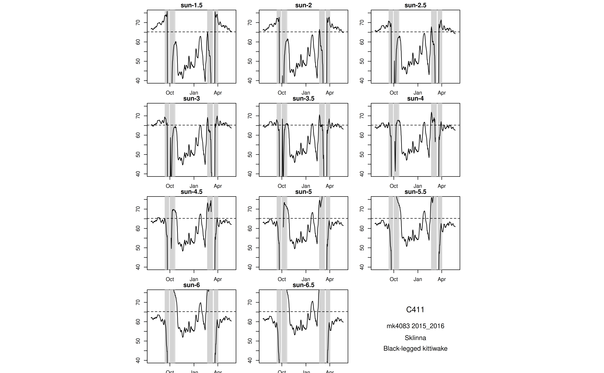

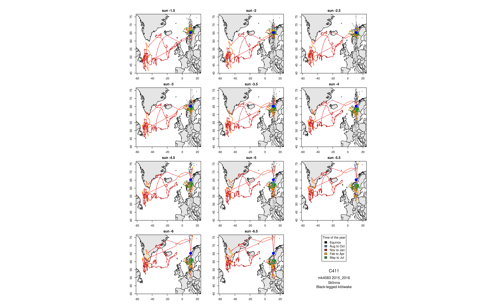

Stare at these plots. Use the force.

By default, this code will also have generated an excel file in the
`calibration` folder. You can use this to enter your calibration values.


You must fill in at least the sun_angle_start column. It is also
reccomended to include your name in the analyzer column.

Once you have filled in your calibration template, you can use these
values to process the light data and export positions.

We can pass a path to the calibration data file:

``` r

calibration_data_path <- file.path(export_dir, "calibration", "calibration.xlsx")
```

At this stage, we might want to include some extra relevant information
in the final data output.

``` r

print(example_extra_metadata)
#>   logger_id date_retrieved logger_producer ring_number country_code
#> 1      C411     2017-06-11        Biotrack     6211704          NOS
```

The final positions are now exported to your `output_dir`.

``` r

head(positions)
#>   logger_id logger_id_year total_years_tracked logger_model start_datetime
#> 1      C411      C411_2017           2015_2017       mk4083     2015-06-12
#> 2      C411      C411_2017           2015_2017       mk4083     2015-06-12
#> 3      C411      C411_2017           2015_2017       mk4083     2015-06-12
#> 4      C411      C411_2017           2015_2017       mk4083     2015-06-12
#> 5      C411      C411_2017           2015_2017       mk4083     2015-06-12
#> 6      C411      C411_2017           2015_2017       mk4083     2015-06-12
#>          end_datetime year_tracked                species
#> 1 2016-05-31 23:59:59    2015_2016 Black-legged kittiwake
#> 2 2016-05-31 23:59:59    2015_2016 Black-legged kittiwake
#> 3 2016-05-31 23:59:59    2015_2016 Black-legged kittiwake
#> 4 2016-05-31 23:59:59    2015_2016 Black-legged kittiwake
#> 5 2016-05-31 23:59:59    2015_2016 Black-legged kittiwake
#> 6 2016-05-31 23:59:59    2015_2016 Black-legged kittiwake
#>                    date_time sun_angle eqfilter   lon_raw  lat_raw lon_smooth1
#> 1     2015-07-25 11:30:42.75      -3.5     TRUE  8.954225 64.47571   11.027464
#> 2 2015-07-25 23:26:25.076923      -3.5     TRUE 10.029073 64.79553    9.491649
#> 3 2015-07-27 11:43:40.404762      -3.5     TRUE  5.714256 61.37273    5.519647
#> 4 2015-07-27 23:37:34.833333      -3.5     TRUE  7.236153 62.03278    6.475204
#> 5 2015-07-28 11:47:04.884615      -3.5     TRUE  4.858584 62.92117    6.047368
#> 6 2015-07-28 23:29:10.384615      -3.5     TRUE  9.333166 64.25771    7.095875
#>   lat_smooth1       lon      lat                     tFirst
#> 1    63.96438 10.268904 64.30201      2015-07-25 01:14:48.5
#> 2    64.63562 10.928250 64.51050        2015-07-25 21:46:37
#> 3    61.37530  5.994907 61.53986 2015-07-27 02:21:00.142857
#> 4    61.70276  6.264015 62.09003 2015-07-27 21:06:20.666667
#> 5    62.47698  6.561618 63.03418        2015-07-28 02:08:49
#> 6    63.58944  8.978497 63.76684 2015-07-28 21:25:20.769231
#>                      tSecond type  colony col_lat col_lon sun_angle_start
#> 1        2015-07-25 21:46:37    1 Sklinna  65.202  10.995            -3.5
#> 2 2015-07-26 01:06:13.153846    2 Sklinna  65.202  10.995            -3.5
#> 3 2015-07-27 21:06:20.666667    1 Sklinna  65.202  10.995            -3.5
#> 4        2015-07-28 02:08:49    2 Sklinna  65.202  10.995            -3.5
#> 5 2015-07-28 21:25:20.769231    1 Sklinna  65.202  10.995            -3.5
#> 6        2015-07-29 01:33:00    2 Sklinna  65.202  10.995            -3.5
#>   sun_angle_end light_threshold noon_filter daylength_filter speed_filter
#> 1          -3.5               9        TRUE             TRUE           70
#> 2          -3.5               9        TRUE             TRUE           70
#> 3          -3.5               9        TRUE             TRUE           70
#> 4          -3.5               9        TRUE             TRUE           70
#> 5          -3.5               9        TRUE             TRUE           70
#> 6          -3.5               9        TRUE             TRUE           70
#>   coast_to_land coast_to_sea loess_filter_k months_breeding_start
#> 1           100          Inf              6                     4
#> 2           100          Inf              6                     4
#> 3           100          Inf              6                     4
#> 4           100          Inf              6                     4
#> 5           100          Inf              6                     4
#> 6           100          Inf              6                     4
#>   months_breeding_end boundary.box_xmin boundary.box_xmax boundary.box_ymin
#> 1                   8               -95               100                30
#> 2                   8               -95               100                30
#> 3                   8               -95               100                30
#> 4                   8               -95               100                30
#> 5                   8               -95               100                30
#> 6                   8               -95               100                30
#>   boundary.box_ymax       analyzer date_retrieved logger_producer ring_number
#> 1                88 Kate Kittiwake     2017-06-11        Biotrack     6211704
#> 2                88 Kate Kittiwake     2017-06-11        Biotrack     6211704
#> 3                88 Kate Kittiwake     2017-06-11        Biotrack     6211704
#> 4                88 Kate Kittiwake     2017-06-11        Biotrack     6211704
#> 5                88 Kate Kittiwake     2017-06-11        Biotrack     6211704
#> 6                88 Kate Kittiwake     2017-06-11        Biotrack     6211704
#>   country_code point_type        raw_data_file
#> 1          NOS       main C411_2017_mk4083.lig
#> 2          NOS       main C411_2017_mk4083.lig
#> 3          NOS       main C411_2017_mk4083.lig
#> 4          NOS       main C411_2017_mk4083.lig
#> 5          NOS       main C411_2017_mk4083.lig
#> 6          NOS       main C411_2017_mk4083.lig
```

Note our extra metadata appended to the end.

Maps are automatically exported.


It is worth examining the filter plots too.

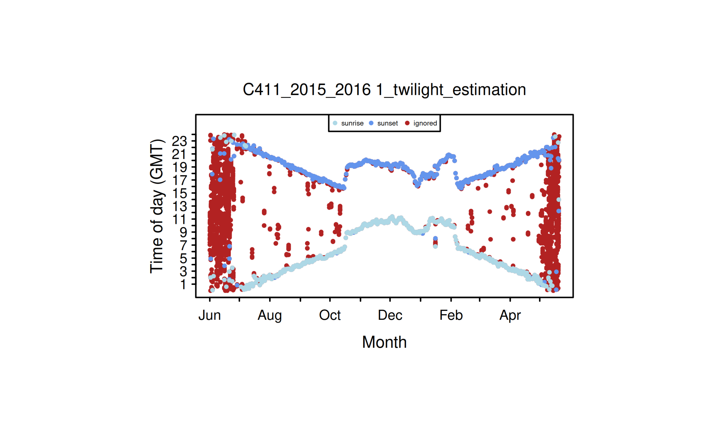

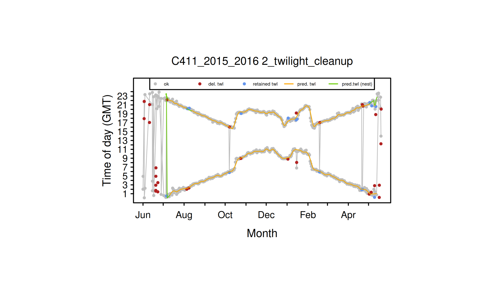

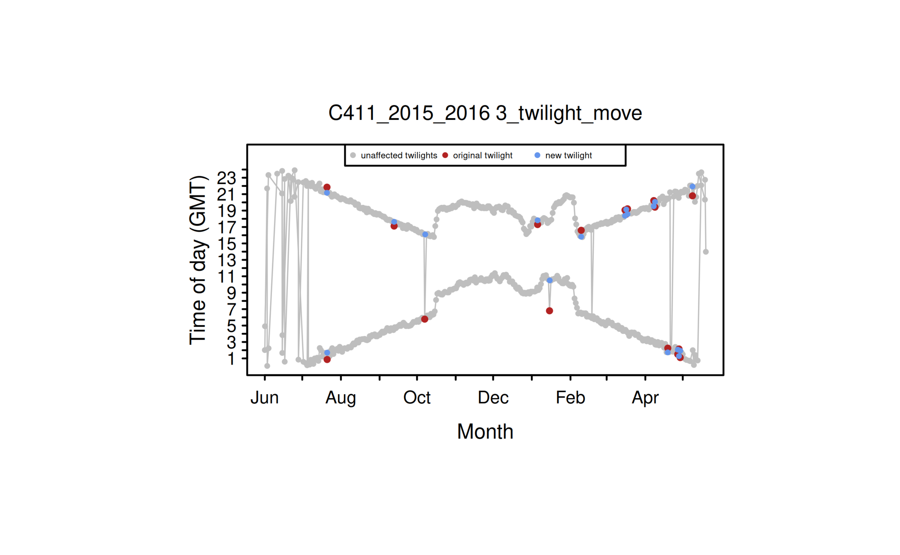

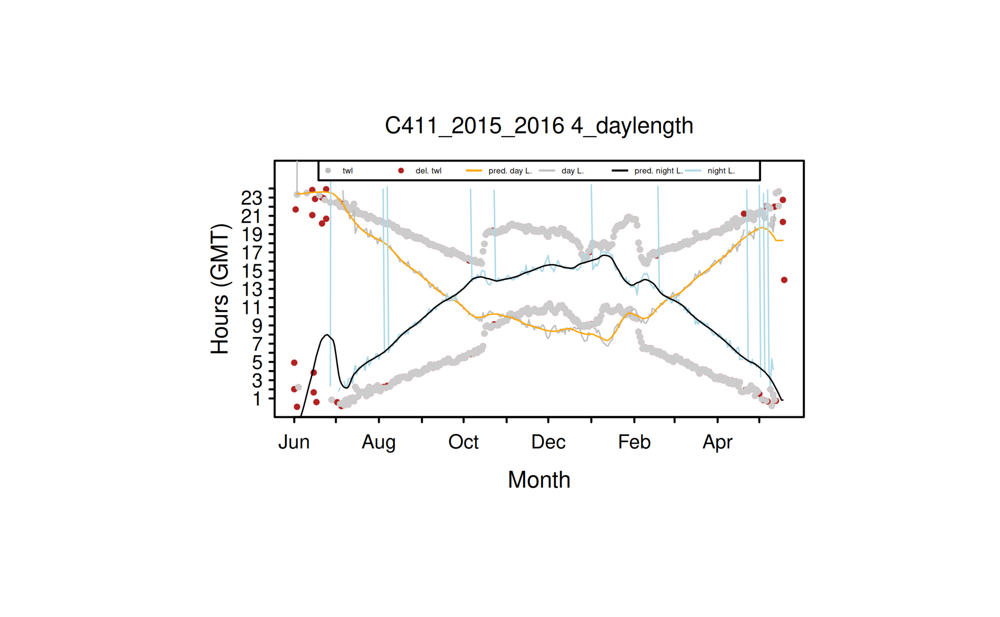

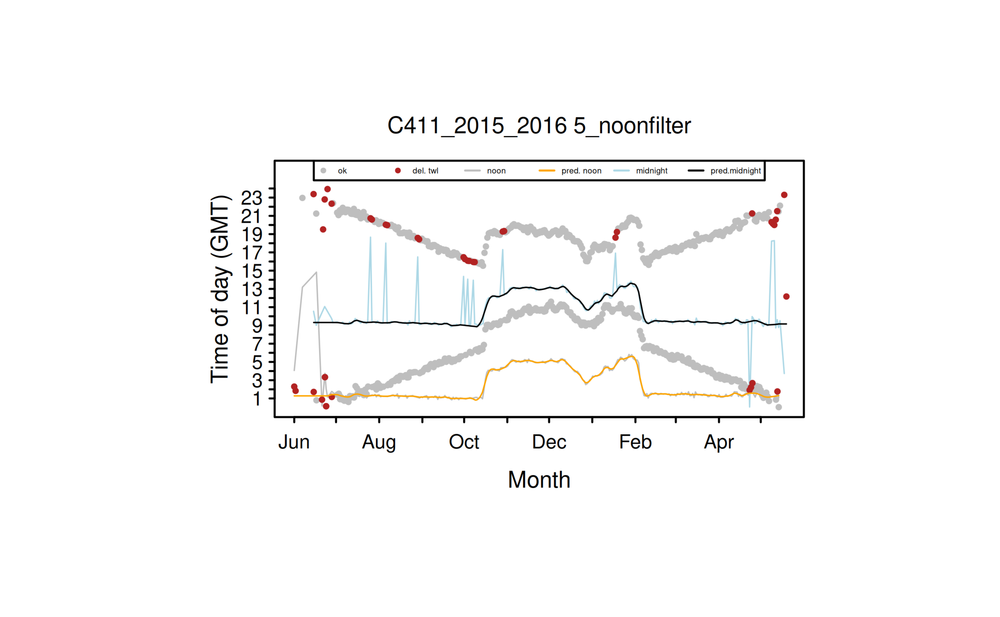

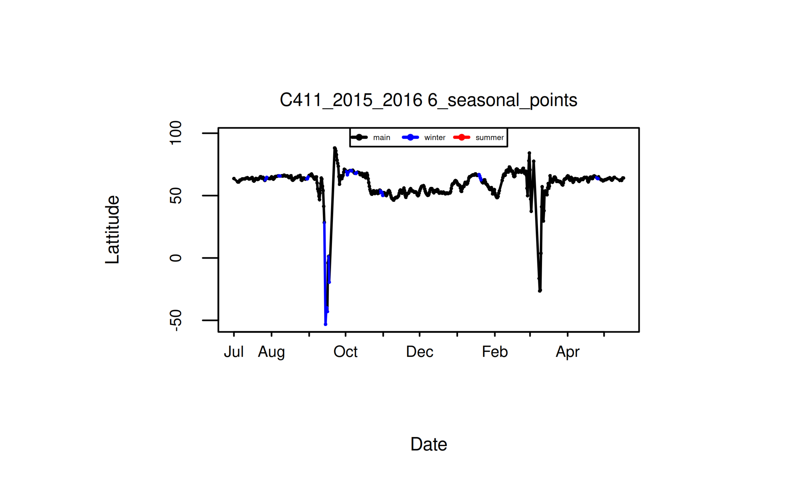

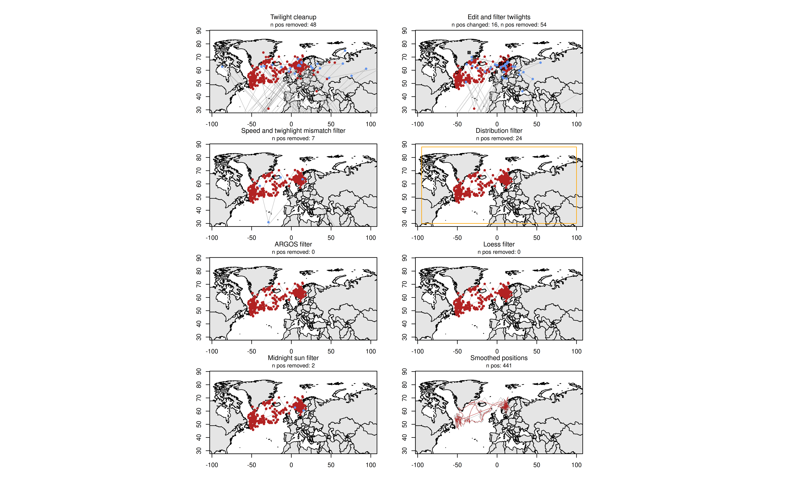

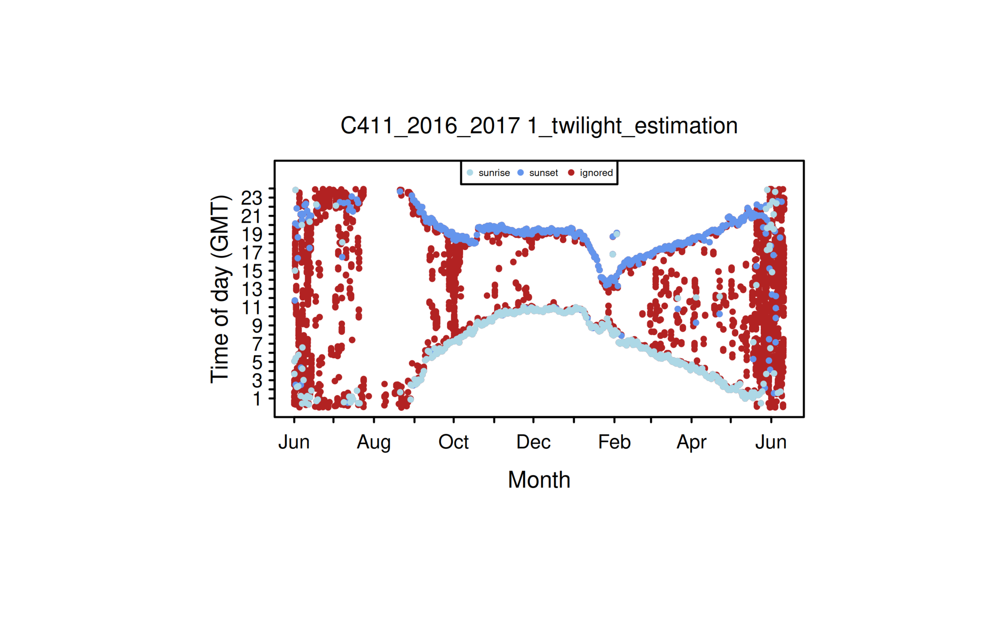

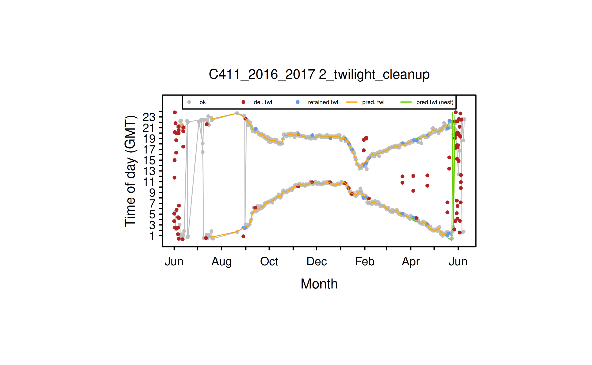


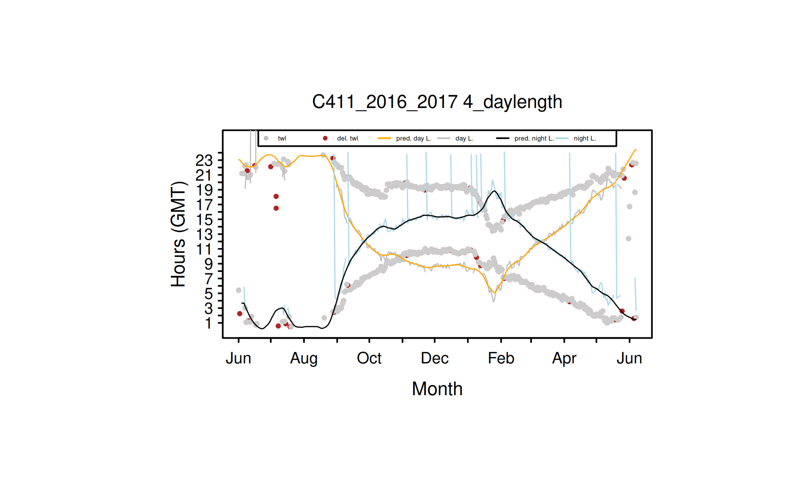


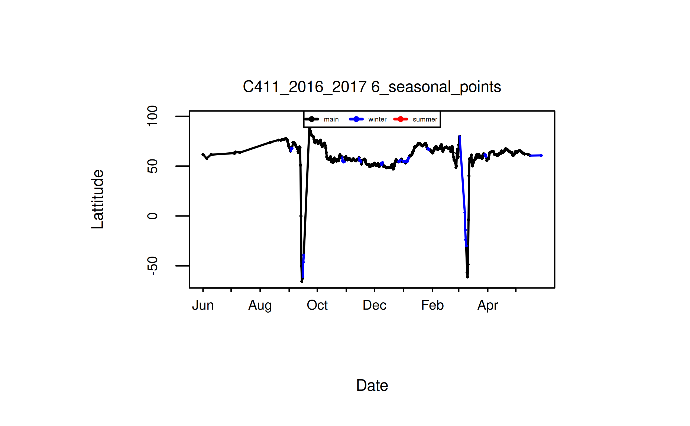

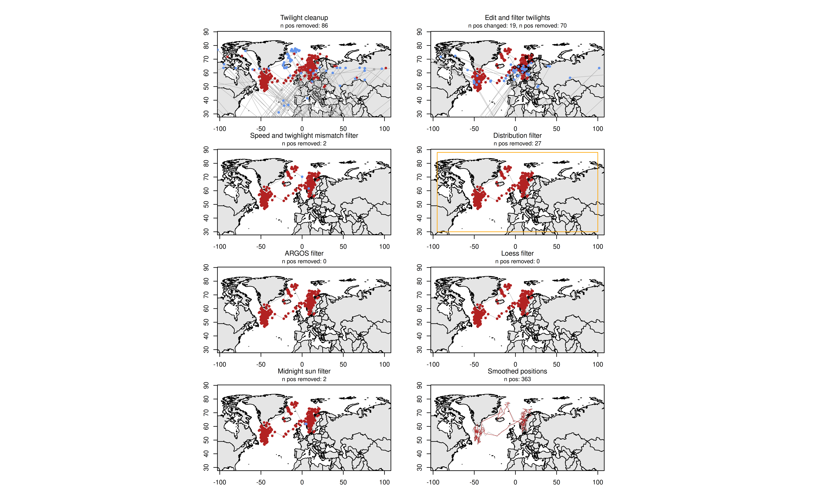
